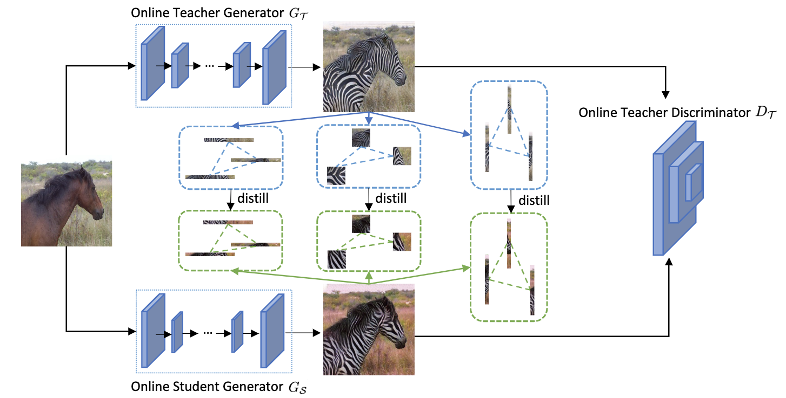

# Exploring Content Relationships For Distilling Efficient GANs

## Overview



## Prerequisites

* Linux
* Python 3
* CPU or NVIDIA GPU + CUDA CuDNN

## Getting Started

### Installation

- Clone this repo:

  ```shell
  git clone https://github.com/CRD-Official/CRD.git
  cd CRD
  ```

- Install dependencies.

  ```shell
  conda create -n CRD python=3.7
  conda activate CRD
  pip install torch==1.7.0 torchvision==0.8.0 torchaudio==0.7.0 
  pip install -r requirements.txt 
  ```

### Data preparation

- edges2shoes

    - Download the dataset
    ```shell
    bash datasets/download_pix2pix_dataset.sh edges2shoes-r
    ```
  
    - Get the statistical information for the ground-truth images for your dataset to compute FID. 
    ```shell
    bash datasets/download_real_stat.sh edges2shoes-r B
    ```

- horse2zebra

    - Download the dataset
    ```shell
    bash datasets/download_cyclegan_dataset.sh horse2zebra
    ```

    - Get the statistical information for the ground-truth images for your dataset to compute FID. 
    ```shell
    bash datasets/download_real_stat.sh horse2zebra A
    bash datasets/download_real_stat.sh horse2zebra B
    ```
    
- summer2winter

    - Download the dataset
    ```shell
    bash datasets/download_cyclegan_dataset.sh summer2winter_yosemite
    ```
    - Get the statistical information for the ground-truth images for your dataset to compute FID from [here](https://drive.google.com/drive/folders/1JKJlpUDdD4TdXdwPwfdWUiF4PsXLAbto)

### Pretrained Model

We provide a list of pre-trained models in [link](https://drive.google.com/drive/folders/1OhVPLM1nHxQtycEdLS38R80yROU-2oNw?usp=share_link).


### Training

- pretrained vgg16
  we should prepare weights of a vgg16 to calculate the style loss 
  
- train student model using CRD
  Run the following script to train a resnet-style student on horse2zebra dataset, 
  all scripts for cyclegan and pix2pix on horse2zebra, summer2winter, and edges2shoes can be found in ./scripts

  ```shell
  bash scripts/cycle_gan/horse2zebra/distill.sh
  ```

### Testing

- test student models, FID will be calculated, take resnet-style generator on horse2zebra dataset as an example

  ```shell
  bash scripts/cycle_gan/horse2zebra/test.sh
  ```

<!-- ## Citation

If you use this code for your research, please cite our paper.
  ```shell

``` -->

## Acknowledgements

Our code is developed based on [GAN Compression](https://github.com/mit-han-lab/gan-compression) and [OMGD](https://github.com/bytedance/OMGD)
